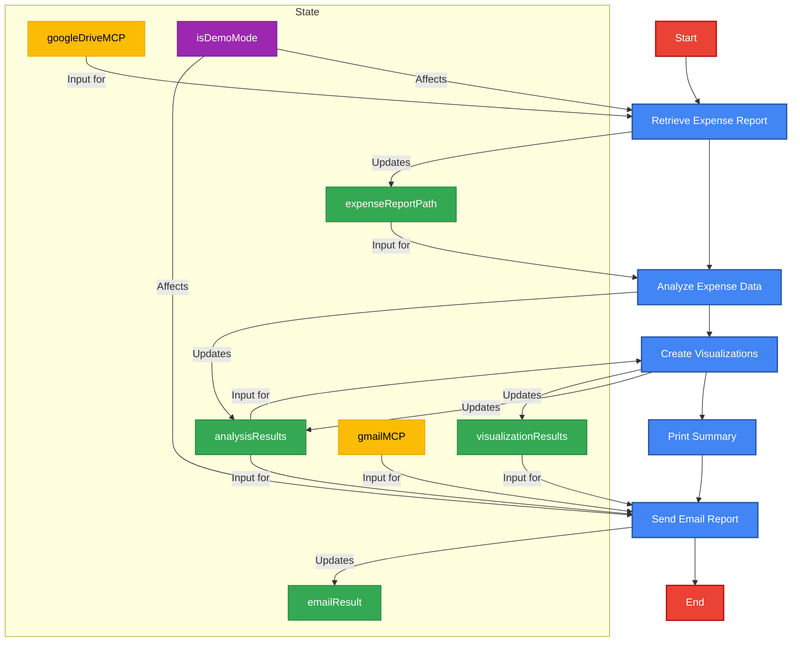

# Monthly Financial Project Workflow

This document visualizes the LangGraph workflow for the Monthly Financial Project.

## LangGraph Workflow Diagram

## Node Descriptions

1. **Retrieve Expense Report**: Fetches expense data from Google Drive or uses sample data in demo mode
2. **Analyze Expense Data**: Processes the expense data to find patterns and generate recommendations
3. **Create Visualizations**: Creates charts and visualizations of the expense data
4. **Print Summary**: Displays a summary of the analysis results
5. **Send Email Report**: Sends the analysis results and visualizations via email

## State Management

The LangGraph workflow maintains state between nodes:

- **expenseReportPath**: Path to the retrieved expense report CSV file
- **analysisResults**: Results of the expense analysis including summary and recommendations
- **visualizationResults**: Paths to generated visualization files
- **emailResult**: Status of the email sending operation
- **googleDriveMCP**: Google Drive MCP instance for file operations
- **gmailMCP**: Gmail MCP instance for sending emails
- **isDemoMode**: Flag indicating if the workflow is running in demo mode

## Benefits of LangGraph

- **Explicit State Management**: State is explicitly defined and passed between nodes
- **Declarative Workflow**: The workflow is defined as a graph with clear node relationships
- **Error Handling**: Each node can handle errors independently
- **Visualization**: The workflow can be visualized as a graph
- **Flexibility**: Nodes can be rearranged or modified without changing the overall structure
